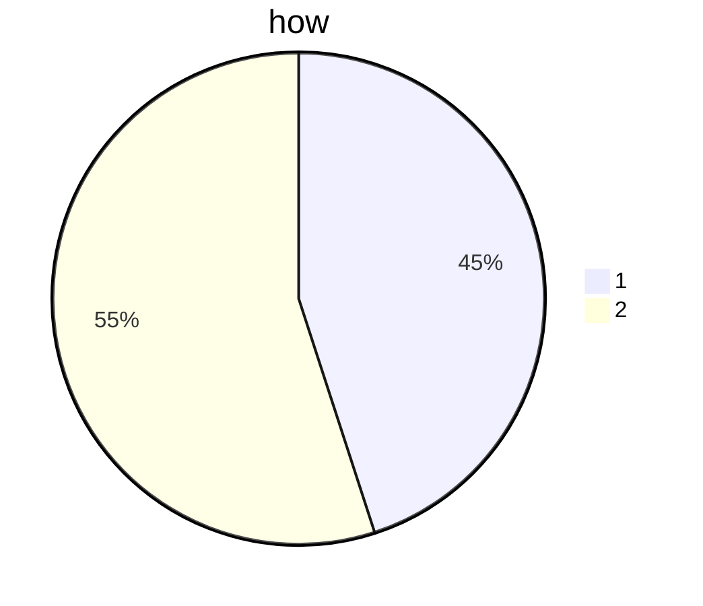

# Markdown 練習
## 1. 標題
markdown裏可以用“#”來將文字設置標題，有多少個#就代表多少級標題<br></br>（最多可以設置到六級的標題）
## 2. 換行
markdown裏面可以用到< br >或者< /br >進行換行<br></br>（符號内空格要刪除）
## 3. 改變字體形態
1. 在文字兩邊添加“ ** ”則是加粗</br>如：
**加粗文字的例子**</br></br>
2. 在文字兩邊添加“ _ ”則是斜體文字</br>如：
_斜體文字的例子_</br></br>
3. 同時是使用“ _** ”則是斜體加粗</br>如：
**_斜體加粗的例子_**</br></br>
4. 在文字兩邊添加“ ~~ ”則是刪除綫</br>如：
~~文字刪除綫的例子~~
</br>

## 4. 分割綫
“ --- ”或者“ ___ ”或者“ *** ”</br>
即三個或以上的斜杠下劃綫和星號</br>
是手動分隔且將上一個分隔内包含的内容全都標題化，但也可以在編輯器内換行避免標題化</br>

如此所示（換行的演示，不代表分割）
---
</br>
</br>


## 5. 列表（分爲無序列表與有序列表）
### 無序列表
在每一行的開頭使用“ - ”來進行列表排序</br>如：
- 無序列表第一行
- 無序列表第二行
- 無序列表第三行
### 有序列表
在每一行的開頭使用“1./2./3./...”來對列表進行排序</br>如：
1. 有序列表第一行
2. 有序列表第二行
3. 有序列表第三行
### 無序列表與有序列表的嵌套使用
- 嵌套的無序一
    1. 嵌套内的有序一
    2. 嵌套内的有序二
- 嵌套的無序二
     - 嵌套内的有序一
     - 嵌套内的有序二
1. 嵌套的有序一
    - 嵌套内的無序一
    - 嵌套内的無序二
2. 嵌套的有序二
    1. 嵌套的有序一
    2. 嵌套的有序二 </br>

_統一記住嵌套使用時嵌套内的内容前面要空四格_

## 6. 超鏈接&圖片
[]内是要在預覽上顯示的文字()内則是會跳轉的鏈接</br>如：
[點此進入谷歌](www.google.com)</br>
![]即在[]前加上感嘆號則是插入圖片()

## 7. 引用
可以使用“ > ”符號來實現引用，以及使用多個如“>>”來實現嵌套引用</br>如：
>這是引用的例子
>>這是第一層嵌套的引用
>>>這是第二層嵌套的引用
>>>>可以以此類推，進行多層的引用

## 8. 代碼塊
即在markdown裏面使用代碼，以反引號“ `` ”包裹展示，多行的代碼用三個反引號展示，并需要在代碼前指定語言</br>如：
- 行内代碼展示：`print("Hello world !")`
- 代碼塊展示：</br>**(記得一定要在代碼結束的下一行以```結束)**
```python
a = input("enter numbers:" )
if int(a) > 10:
  print(f"{a} is bigger than 10")
elif int(a) = 10:
  print(f"{a} is equal to 10")
else:
  print(f"{a} is less than 10")
```

## 9. 表格
在markdown裏面可以通過“ - ”和“ | ”來組成表格</br>
具體如下：</br>
|與會人員|聯係方式|常駐城市|
|:-----|:-------:|-------:|
|Anne|1234-5678|Shanghai|
|Frank|23456789|Guangzhou|
|Peter|+85234567890|HongKong|
|Martin|852-4567-8901|Macau|

可以在-----所在的那一行添加“:”來表示該列如何對齊</br>
如:</br>: ----則是靠左對齊</br> : ---- : 則是居中對齊</br>---- : 則是開右對齊

</br></br></br></br></br></br></br></br></br></br></br>


## 10. 數學公式表達</br>
**大概率應該用不到啦，而且LaTeX他原生也不支持，看看就好了**
**可能有些YTB影片會教**
數學公式表達用dollar符號表示
行内公式表達用單個dollar包裹，如：</br>
行内公式展示$E = mc^2$
數學公式塊表示用兩個dollar包裹，如：</br>
$$E = mc^2$$
$$a = {-b±\sqrt{b^2-4ac}\over 2a}$$


## 11. mermaid
**本質上就是某種語言啦而且VS Code原生并不支持，看看就好了**</br>
**也是有些YTB影片會教**


